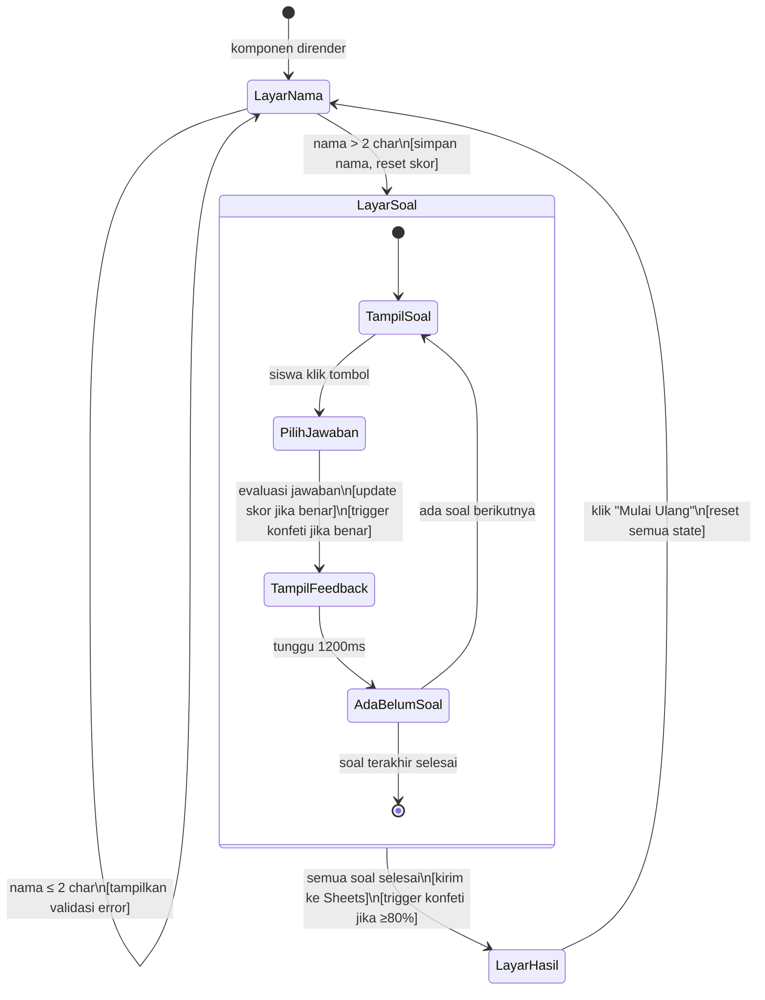

# Design Document — `explode-quiz` (interactive-quiz)

## Overview

`explode-quiz` adalah komponen web kuis pilihan ganda interaktif yang dibangun sebagai LitElement
standar dalam monorepo `@haxtheweb/`. Komponen ini mengelola empat layar (Layar_Nama →
Layar_Soal → Layar_Hasil → Layar_Editor) sebagai state machine satu berkas, mengintegrasikan efek
konfeti via `canvas-confetti`, dan melaporkan hasil kuis ke Google Sheets melalui `google.script.run`.

Komponen mengikuti seluruh konvensi monorepo HAX:
- Mewarisi `I18NMixin(DDDSuper(LitElement))`
- Pure ES modules, tidak ada TypeScript
- Semua nilai desain menggunakan DDD CSS custom properties (Token_DDD)
- Menyediakan `static get haxProperties()` untuk integrasi HAX authoring

---

## Architecture

### Hierarchy Komponen

```
<explode-quiz>                 ← satu-satunya custom element
  ├── [Layar_Nama]             ← render branch: screen === 'name'
  │     ├── .quiz-title
  │     ├── .quiz-instruction
  │     ├── input#name-input
  │     ├── button.start-btn
  │     └── p.validation-error (conditional)
  │
  ├── [Layar_Soal]             ← render branch: screen === 'question'
  │     ├── header.quiz-header
  │     │     ├── .progress-label   ("Soal N dari M")
  │     │     └── .score-display    ("Skor: X")
  │     ├── .question-text
  │     ├── .answer-grid
  │     │     └── button.answer-btn × 4
  │     └── .feedback-area (conditional)
  │
  ├── [Layar_Hasil]            ← render branch: screen === 'result'
  │     ├── .result-name
  │     ├── .result-score
  │     ├── .result-percentage
  │     ├── .result-message
  │     └── button.restart-btn
  │
  └── [Layar_Editor]           ← render branch: editing === true
        ├── header.edit-header
        │     ├── h2.edit-title
        │     └── button.close-editor-btn
        ├── .editor-content
        │     ├── form.add-question-form
        │     │     ├── textarea.question-text
        │     │     ├── .choices-container
        │     │     │     ├── input.choice-input × 4
        │     │     │     └── .choice-labels (radio buttons)
        │     │     └── button.add-question-btn
        │     └── .questions-list
        │           ├── .question-card × N
        │           │     ├── .card-header
        │           │     │     ├── .question-preview
        │           │     │     ├── .card-actions
        │           │     │     │     ├── button.edit-btn
        │           │     │     │     └── button.delete-btn (disabled if < 3 questions)
        │           │     └── .edit-form (hidden by default)
        │           │           ├── textarea.question-text-edit
        │           │           ├── .choices-container-edit
        │           │           │     ├── input.choice-input-edit × 4
        │           │           │     └── .choice-labels-edit (radio buttons)
        │           │           ├── button.save-edit-btn
        │           │           └── button.cancel-edit-btn
        └── .editor-actions
              ├── button.save-all-btn
              └── button.cancel-all-btn
```

Sama seperti `todo-list`, editor UI dibangun di dalam komponen yang sama, tanpa sub-komponen
terpisah. Satu berkas `explode-quiz.js` mengelola semua layar termasuk editor.

### State Machine Layar

```
┌───────────────────────────────────────────────────────────────────┐
│                       ExplodeQuiz State                           │
│                                                                   │
│  [screen = 'name']                                                │
│       │                                                           │
│       │ _startQuiz()  (nama > 2 karakter)                        │
│       ▼                                                           │
│  [screen = 'question']                                            │
│       │                                                           │
│       │ _selectAnswer() → feedback → setTimeout(800–1500ms)      │
│       │   ├─ currentIndex < questions.length - 1 → next question │
│       │   └─ currentIndex === questions.length - 1               │
│       │         → _submitResult() → screen = 'result'            │
│       ▼                                                           │
│  [screen = 'result']                                              │
│       │                                                           │
│       │ _restartQuiz()                                            │
│       └──────────────────────────────► [screen = 'name']         │
│                                                                   │
│  [editing = true]                                                 │
│       │                                                           │
│       │ _openEditor()                                             │
│       ▼                                                           │
│  [screen = 'editor']                                              │
│       │                                                           │
│       │ _saveAll() / _cancelAll()                                 │
│       └──────────────────────────────► [screen = 'result']       │
└───────────────────────────────────────────────────────────────────┘
```

---

## Components and Interfaces

### Public API (Properties)

| Properti           | Tipe      | Default              | Keterangan                                          |
|--------------------|-----------|----------------------|-----------------------------------------------------|
| `questions`        | `Array`   | `DEFAULT_QUESTIONS`  | Daftar soal kustom yang dapat diinjeksi dari luar   |
| `scriptFunctionName` | `String` | `'submitQuizResult'` | Nama fungsi Google Apps Script yang dipanggil       |
| `editing`          | `Boolean` | `false`              | Mode editor (menampilkan Layar_Editor saat `true`) |

### Internal State (Private Properties dengan prefix `_`)

| Properti             | Tipe      | Default     | Keterangan                                         |
|----------------------|-----------|-------------|----------------------------------------------------|
| `_screen`            | `String`  | `'name'`    | Layar aktif: `'name'` / `'question'` / `'result'` / `'editor'` |
| `_studentName`       | `String`  | `''`        | Nama siswa yang diinput di Layar_Nama               |
| `_currentIndex`      | `Number`  | `0`         | Indeks soal saat ini dalam array `questions`        |
| `_score`             | `Number`  | `0`         | Jumlah jawaban benar saat ini                       |
| `_answered`          | `Boolean` | `false`     | Apakah soal saat ini telah dijawab                  |
| `_selectedIndex`     | `Number`  | `-1`        | Indeks tombol jawaban yang dipilih siswa            |
| `_feedbackText`      | `String`  | `''`        | Teks umpan balik yang ditampilkan setelah jawaban   |
| `_feedbackPositive`  | `Boolean` | `false`     | `true` = jawaban benar, mempengaruhi warna feedback |
| `_validationError`   | `String`  | `''`        | Pesan validasi untuk kolom nama                     |
| `_nameInputValue`    | `String`  | `''`        | Nilai input nama yang terikat secara reaktif        |
| `_editing`           | `Boolean` | `false`     | Mode editor aktif                                   |
| `_tempQuestions`     | `Array`   | `[]`        | Salinan questions saat sedang diedit (before save)  |
| `_editingIndex`      | `Number`  | `-1`        | Index soal yang sedang diedit (-1 = none)           |

### New Internal Methods

#### `_openEditor()`
- Guard: only allow opening editor from `'result'` screen
- Set `_editing = true`, set `_editingIndex = -1`
- Deep copy current `questions` array to `_tempQuestions`
- Set `_screen = 'editor'`

#### `_cancelAll()`
- Guard: only allow cancelling from `'editor'` screen
- Reset `_editing = false`, set `_editingIndex = -1`
- Set `_screen` kembali ke `'result'` (discard `_tempQuestions`, keep original `questions`)

#### `_saveAll()`
- Guard: only allow saving from `'editor'` screen
- Assign `_tempQuestions` ke `this.questions` (triggers reactive update)
- Reset `_editing = false`, set `_editingIndex = -1`
- Set `_screen = 'result'`

#### `_addQuestion()`
- Guard: form validation (question text ≠ empty, all 4 choices ≠ empty)
- Create new Question object with `correctIndex` from selected radio button
- Push to `_tempQuestions`
- Reset form fields (question text, 4 choices, correctIndex selection)
- Scroll to newly added question card

#### `_deleteQuestion(index)`
- Guard: if `_tempQuestions.length <= 3`, do not allow deletion
- Remove question at `index` from `_tempQuestions`
- If current `_editingIndex === index`, reset `_editingIndex = -1`

#### `_startEditQuestion(index)`
- Set `_editingIndex = index`
- Load question data at `index` into temporary form fields (question text, 4 choices, correctIndex)
- Scroll to edit form in question card

#### `_saveEditQuestion()`
- Validate form (question text ≠ empty, all 4 choices ≠ empty)
- Update question at `_editingIndex` in `_tempQuestions`
- Reset `_editingIndex = -1` (close edit form)
- Remove temporary form field values

#### `_cancelEditQuestion()`
- Guard: only allow cancelling when `_editingIndex !== -1`
- Reset `_editingIndex = -1` (discard temporary changes)
- Remove temporary form field values

---

### Editor Rendering Method

#### `_renderEditorScreen()`

Returns the editor screen template with:

**Header:**
- `.edit-title` ("Edit Soal Kuis")
- `.close-editor-btn` with `aria-label`, `@click="_saveAll()"`

**Add Question Form (`.add-question-form`):**
- `textarea.question-text-input` for question text (placeholder, `aria-label`, bound to `_tempQuestionText`)
- `.choices-container` with 4 `input.choice-input` elements (choices 0-3, `aria-label`, bound to `_tempChoice{N}`)
- `.choice-labels` with 4 radio buttons (correctIndex selection, `aria-label`, `value="{0..3}"`)
- `.add-question-btn` with `aria-label`, `@click="_addQuestion()"`

**Questions List (`.questions-list`):**
- `.question-card` for each question in `_tempQuestions`:
  - `.card-header`: `.question-preview` (truncated question text), `.card-actions` with `.edit-btn` and `.delete-btn` (disabled if length <= 3)
  - `.edit-form` (hidden by default): textarea, 4 inputs, 4 radio buttons, `.save-edit-btn`, `.cancel-edit-btn`

**Footer (`.editor-actions`):**
- `.save-all-btn` with `aria-label`, `@click="_saveAll()"`
- `.cancel-all-btn` with `aria-label`, `@click="_cancelAll()"`

---

### Key Algorithms: Editor Operations

### 6. Open Editor (`_openEditor`)

```
INPUT: none
PRE: _screen === 'result'

1. Guard: _editing === false
2. _editing = true
3. _editingIndex = -1
4. _tempQuestions = JSON.parse(JSON.stringify(this.questions))  // deep copy
5. _screen = 'editor'
6. Focus on add question form textarea
```

### 7. Cancel All (`_cancelAll`)

```
INPUT: none
PRE: _screen === 'editor'

1. Guard: _editing === true
2. _editing = false
3. _editingIndex = -1
4. _screen = 'result'
5. _tempQuestions discarded (original this.questions preserved)
```

### 8. Save All (`_saveAll`)

```
INPUT: none
PRE: _screen === 'editor'

1. Guard: _editing === true
2. this.questions = _tempQuestions  // triggers reactive update
3. _editing = false
4. _editingIndex = -1
5. _screen = 'result'
6. _tempQuestions discarded
```

### 9. Add Question (`_addQuestion`)

```
INPUT: none (uses temporary form fields)

1. Guard: _editingIndex === -1 (not editing existing)
2. Guard: _tempQuestionText.trim().length > 0
3. Guard: all 4 _tempChoice{N}.trim().length > 0
4. Create Question object:
   - question = _tempQuestionText.trim()
   - choices = [_tempChoice0, _tempChoice1, _tempChoice2, _tempChoice3]
   - correctIndex = parseInt(_tempCorrectIndex)
5. Push to _tempQuestions
6. Reset form fields (_tempQuestionText = '', 4 choices = '', correctIndex = '0')
7. Scroll to newly added question card
```

### 10. Delete Question (`_deleteQuestion(index)`)

```
INPUT: index (integer)

1. Guard: _tempQuestions.length > 3
2. Guard: index >= 0 && index < _tempQuestions.length
3. IF _editingIndex === index: _editingIndex = -1
4. Remove _tempQuestions[index]
5. If deleted question was last, scroll to bottom of list
```

### 11. Start Edit Question (`_startEditQuestion(index)`)

```
INPUT: index (integer)

1. Guard: index >= 0 && index < _tempQuestions.length
2. _editingIndex = index
3. Load question data into temporary form fields:
   - _tempQuestionText = _tempQuestions[index].question
   - _tempChoice0..3 = _tempQuestions[index].choices[]
   - _tempCorrectIndex = _tempQuestions[index].correctIndex.toString()
4. Scroll to edit form in question card at `index`
```

### 12. Save Edit Question (`_saveEditQuestion`)

```
INPUT: none

1. Guard: _editingIndex !== -1
2. Guard: _tempQuestionText.trim().length > 0
3. Guard: all 4 _tempChoice{N}.trim().length > 0
4. _tempQuestions[_editingIndex].question = _tempQuestionText.trim()
5. _tempQuestions[_editingIndex].choices = [_tempChoice0, _tempChoice1, _tempChoice2, _tempChoice3]
6. _tempQuestions[_editingIndex].correctIndex = parseInt(_tempCorrectIndex)
7. _editingIndex = -1
8. Reset temporary form field values
```

### 13. Cancel Edit Question (`_cancelEditQuestion`)

```
INPUT: none

1. Guard: _editingIndex !== -1
2. Reset temporary form field values (_tempQuestionText, 4 choices, correctIndex)
3. _editingIndex = -1
```

---

### Editor UI Strings (i18n)

```js
this.t = {
  // ... existing strings ...
  
  // Editor
  editTitle: 'Edit Soal Kuis',
  closeEditor: 'Tutup Editor',
  questionPlaceholder: 'Tulis pertanyaan...',
  choicePlaceholder: 'Pilihan {N}',
  choiceCorrectLabel: 'Benar',
  addQuestionBtn: 'Tambah Soal',
  editQuestionBtn: 'Edit',
  deleteQuestionBtn: 'Hapus',
  saveEditBtn: 'Simpan Perubahan',
  cancelEditBtn: 'Batal',
  saveAllBtn: 'Simpan & Keluar',
  cancelAllBtn: 'Batal',
  minQuestionsError: 'Minimal 3 soal harus tersedia',
  emptyQuestionError: 'Pertanyaan tidak boleh kosong',
  emptyChoiceError: 'Semua pilihan jawaban harus diisi',
  
  // Editor aria-labels
  ariaEditTitle: 'Panel editor soal kuis',
  ariaCloseEditor: 'Tutup panel editor',
  ariaAddForm: 'Formulir tambah soal baru',
  ariaQuestionInput: 'Teks pertanyaan',
  ariaChoiceInput: 'Pilihan jawaban {N}',
  ariaCorrectChoice: 'Pilihan jawaban benar',
  ariaQuestionsList: 'Daftar soal yang tersedia',
  ariaQuestionCard: 'Kartu soal',
  ariaEditQuestion: 'Edit soal ini',
  ariaDeleteQuestion: 'Hapus soal ini',
  ariaSaveEdit: 'Simpan perubahan soal',
  ariaCancelEdit: 'Batal mengedit soal',
  ariaSaveAll: 'Simpan semua perubahan dan keluar',
  ariaCancelAll: 'Batal semua perubahan dan keluar',
}
```

### SheetsConnector (Internal Function)

`_submitToSheets(name, score)` — dipanggil saat `_screen` berpindah ke `'result'`.

```js
_submitToSheets(name, score) {
  if (typeof globalThis.google === 'undefined' || !globalThis.google?.script?.run) {
    console.warn('[explode-quiz] google.script.run tidak tersedia — melewati pengiriman ke Sheets')
    return
  }
  const payload = {
    timestamp: new Date().toISOString(),  // ISO 8601
    name,
    score,
  }
  globalThis.google.script.run
    .withSuccessHandler(() => console.log('[explode-quiz] Data berhasil dikirim ke Sheets'))
    .withFailureHandler((err) => console.error('[explode-quiz] Gagal mengirim ke Sheets:', err))
    [this.scriptFunctionName](payload)
}
```

---

## Data Models

### Objek `Question`

```js
/**
 * @typedef {Object} Question
 * @property {string} question      - Teks pertanyaan
 * @property {string[]} choices     - Array tepat 4 pilihan jawaban (indeks 0–3)
 * @property {number} correctIndex  - Indeks jawaban benar dalam array choices (0–3)
 */
```

**Contoh:**

```js
{
  question: 'Apa ibu kota Indonesia?',
  choices: ['Bandung', 'Surabaya', 'Jakarta', 'Medan'],
  correctIndex: 2,
}
```

### Default Questions (minimal 3 soal bawaan)

```js
const DEFAULT_QUESTIONS = [
  {
    question: 'Apa ibu kota Indonesia?',
    choices: ['Bandung', 'Surabaya', 'Jakarta', 'Medan'],
    correctIndex: 2,
  },
  {
    question: 'Berapa hasil dari 7 × 8?',
    choices: ['54', '56', '58', '60'],
    correctIndex: 1,
  },
  {
    question: 'Planet terdekat dengan Matahari adalah?',
    choices: ['Venus', 'Bumi', 'Mars', 'Merkurius'],
    correctIndex: 3,
  },
]
```

### Quiz Session State

State sesi kuis sepenuhnya dipegang oleh internal properties komponen. Tidak ada penyimpanan
eksternal (localStorage/sessionStorage) — setiap `_restartQuiz()` mereset semua state ke nilai
awal.

```js
// Reset pada _restartQuiz():
this._screen = 'name'
this._studentName = ''
this._currentIndex = 0
this._score = 0
this._answered = false
this._selectedIndex = -1
this._feedbackText = ''
this._feedbackPositive = false
this._validationError = ''
this._nameInputValue = ''
```

---

## Key Algorithms

### 1. Validasi Nama (`_startQuiz`)

```
INPUT: nilai input nama (string)
1. trim() → namaTrimmed
2. IF namaTrimmed.length <= 2 → set _validationError, return (stay on 'name')
3. ELSE → _studentName = namaTrimmed, _validationError = '', _screen = 'question'
```

Batas ≤ 2 karakter (bukan < 2) karena requirement menyebut "lebih dari 2 karakter"
sebagai syarat valid (Req 2.3 dan 2.6).

### 2. Evaluasi Jawaban (`_selectAnswer(choiceIndex)`)

```
INPUT: choiceIndex (0–3)
PRE: _answered === false (guard — tombol sudah disabled setelah jawaban pertama)

1. _answered = true
2. _selectedIndex = choiceIndex
3. correctIndex = questions[_currentIndex].correctIndex
4. isCorrect = (choiceIndex === correctIndex)

5. IF isCorrect:
     _score += 1
     _feedbackText = t.feedbackCorrect   ("Mantap, Benar!")
     _feedbackPositive = true
     _fireConfetti()

6. ELSE:
     _feedbackText = t.feedbackWrong + questions[_currentIndex].choices[correctIndex]
     _feedbackPositive = false

7. Jadwalkan _advanceQuiz() setelah 1200ms (dalam rentang 800–1500ms per requirement)
```

### 3. Auto-Advance (`_advanceQuiz`)

```
1. IF _currentIndex < questions.length - 1:
     _currentIndex += 1
     _answered = false
     _selectedIndex = -1
     _feedbackText = ''
     _feedbackPositive = false

2. ELSE (soal terakhir):
     _submitToSheets(_studentName, _score)
     _screen = 'result'
     IF (_score / questions.length) >= 0.8 → _fireConfetti()
```

### 4. Kalkulasi Skor dan Pesan Apresiasi

```
percentage = Math.round((_score / questions.length) * 100)

IF percentage >= 80  → t.messageHigh    ("Luar Biasa! Kamu Hebat!")
IF percentage >= 50  → t.messageMedium  ("Bagus! Terus Berlatih!")
ELSE                 → t.messageLow     ("Jangan Menyerah! Coba Lagi!")
```

### 5. Trigger Konfeti (`_fireConfetti`)

```js
_fireConfetti() {
  if (typeof this._confettiFn !== 'function') return
  try {
    this._confettiFn({
      particleCount: 120,
      spread: 70,
      origin: { y: 0.6 },
    })
  } catch (err) {
    console.error('[explode-quiz] Konfeti gagal dieksekusi:', err)
  }
}
```

`_confettiFn` di-set dalam `connectedCallback` setelah dynamic import:

```js
async connectedCallback() {
  super.connectedCallback()
  try {
    const mod = await import('canvas-confetti/dist/confetti.module.mjs')
    this._confettiFn = mod.default
  } catch (err) {
    console.warn('[explode-quiz] canvas-confetti gagal dimuat — efek konfeti dinonaktifkan:', err)
    this._confettiFn = null
  }
}
```

Dengan menyimpan fungsi di `_confettiFn`, konfeti hanya dipicu sekali per panggilan eksplisit dan
tidak bergantung pada side-effect render.

---

## Google Sheets Integration Design

### Alur Integrasi

```
ExplodeQuiz
    │
    │ _submitToSheets(name, score) dipanggil saat _advanceQuiz() mencapai soal terakhir
    │
    ▼
SheetsConnector (fungsi internal)
    │
    ├─ [google.script.run tersedia] ─────────────────────────────┐
    │       │                                                    │
    │       │ google.script.run                                  │
    │       │   .withSuccessHandler(onSuccess)                   │
    │       │   .withFailureHandler(onFailure)                   │
    │       │   [scriptFunctionName](payload)                    │
    │       │                                                    │
    │       ├─ onSuccess → console.log("[explode-quiz] OK")      │
    │       └─ onFailure → console.error("[explode-quiz] ERR")   │
    │                                                            │
    └─ [google.script.run TIDAK tersedia] ───────────────────────┘
            │
            └─ console.warn + lanjutkan ke Layar_Hasil (tidak ada user-facing error)
```

### Payload Format

```js
{
  timestamp: '2024-01-15T08:30:00.000Z',  // ISO 8601, dibuat saat submit
  name: 'Budi Santoso',
  score: 2,
}
```

Payload dikirim sebagai satu argumen objek JSON ke fungsi Apps Script yang dikonfigurasi via
`scriptFunctionName` (default: `'submitQuizResult'`).

### Apps Script Side (Referensi)

```js
// Contoh implementasi di Google Apps Script (bukan bagian dari komponen)
function submitQuizResult(payload) {
  const sheet = SpreadsheetApp.getActiveSheet()
  sheet.appendRow([payload.timestamp, payload.name, payload.score])
}
```

### Graceful Degradation Matrix

| Kondisi                              | Perilaku Komponen                                      |
|--------------------------------------|--------------------------------------------------------|
| `google.script.run` tersedia, sukses | Log konfirmasi, tampilkan Layar_Hasil                  |
| `google.script.run` tersedia, gagal  | Log error, tetap tampilkan Layar_Hasil tanpa gangguan  |
| `google.script.run` tidak tersedia   | Log peringatan, langsung tampilkan Layar_Hasil         |
| `canvas-confetti` gagal dimuat       | Log peringatan, kuis tetap berfungsi penuh             |
| `confetti()` lempar exception        | Log error, kuis tetap berfungsi penuh                  |

---

## CSS / Styling Approach

### Prinsip Utama

1. **DDD tokens only** — tidak ada nilai hard-coded untuk warna, spasi, font, radius, bayangan
2. **Single-column fluid layout** — max-width 640px, terpusat dengan `margin: 0 auto`
3. **WCAG 2.0 AA** — semua teks menggunakan token DDD yang sudah diaudit kontrasnya
4. **Touch targets** — tombol jawaban minimal 44px tinggi pada semua viewport

### Token DDD yang Digunakan

```css
/* Tipografi */
font-family: var(--ddd-font-primary)
font-size:   var(--ddd-font-size-s), var(--ddd-font-size-m), var(--ddd-font-size-xl)
font-weight: var(--ddd-font-weight-bold)

/* Warna */
color:       var(--ddd-theme-primary), var(--ddd-theme-disabled), var(--ddd-theme-error)
background:  var(--ddd-theme-background), var(--ddd-theme-polaris-surface)
border:      var(--ddd-theme-polaris-border), var(--ddd-theme-accent)
accent:      var(--ddd-theme-polaris-primary)

/* Spasi */
padding/margin: var(--ddd-spacing-2) … var(--ddd-spacing-10)
gap:            var(--ddd-spacing-3), var(--ddd-spacing-4)

/* Radius & Bayangan */
border-radius:  var(--ddd-radius-md), var(--ddd-radius-lg), var(--ddd-radius-xl)
box-shadow:     0 var(--ddd-spacing-1) var(--ddd-spacing-5) rgba(0,0,0,0.08)
```

### Layout Responsif

```css
/* Host container */
:host {
  display: block;
  max-width: 640px;
  margin: 0 auto;
  padding: var(--ddd-spacing-8);
  font-family: var(--ddd-font-primary);
}

/* Tombol jawaban — grid 2 kolom default, 1 kolom di mobile */
.answer-grid {
  display: grid;
  grid-template-columns: 1fr 1fr;
  gap: var(--ddd-spacing-3);
}

@media (max-width: 480px) {
  .answer-grid {
    grid-template-columns: 1fr;
  }
  .answer-btn {
    min-height: 44px;  /* touch target WCAG */
    padding: var(--ddd-spacing-4) var(--ddd-spacing-5);
  }
}
```

### State Warna Tombol Jawaban

| State            | CSS Class tambahan   | Token DDD                             |
|------------------|----------------------|---------------------------------------|
| Default          | (none)               | `--ddd-theme-polaris-surface`         |
| Correct selected | `.answer-btn--correct` | `--ddd-theme-success` (atau accent)  |
| Wrong selected   | `.answer-btn--wrong`   | `--ddd-theme-error`                  |
| Correct reveal   | `.answer-btn--correct` | Sama seperti correct selected         |
| Disabled         | `[disabled]` attr    | `--ddd-theme-disabled` / opacity 0.5  |

### Focus Indicator (WCAG 2.1)

```css
button:focus-visible,
input:focus-visible {
  outline: none;
  box-shadow: 0 0 0 3px var(--ddd-theme-polaris-focus-ring, var(--ddd-theme-link-light));
}
```

---

## i18n String Keys

Semua string yang terlihat oleh pengguna didefinisikan dalam `constructor()` sebagai `this.t = { ... }`
mengikuti pola I18NMixin monorepo.

```js
this.t = {
  // Layar_Nama
  quizTitle:           'Kuis Interaktif',
  quizInstruction:     'Masukkan nama Anda untuk memulai kuis.',
  namePlaceholder:     'Nama Anda...',
  startButton:         'Mulai Kuis',
  validationNameEmpty: 'Nama tidak boleh kosong.',
  validationNameShort: 'Nama harus lebih dari 2 karakter.',

  // Layar_Soal
  questionOf:          'Soal',           // "Soal {N} dari {M}"
  of:                  'dari',
  scoreLabel:          'Skor',           // "Skor: {X}"
  feedbackCorrect:     'Mantap, Benar!',
  feedbackWrongPrefix: 'Yah, Salah. Jawaban benar: ',

  // Layar_Hasil
  resultHeading:       'Hasil Kuis',
  resultName:          'Nama',
  resultScore:         'Skor',
  resultTotal:         'Total Soal',
  resultPercentage:    'Persentase',
  messageHigh:         'Luar Biasa! Kamu Hebat!',
  messageMedium:       'Bagus! Terus Berlatih!',
  messageLow:          'Jangan Menyerah! Coba Lagi!',
  restartButton:       'Mulai Ulang',

  // Aksesibilitas aria-label
  ariaNameInput:       'Kolom nama siswa',
  ariaStartButton:     'Tombol mulai kuis',
  ariaAnswerButton:    'Pilihan jawaban',   // prefix; diikuti teks pilihan
  ariaRestartButton:   'Mulai ulang kuis',
  ariaScoreDisplay:    'Skor saat ini',
  ariaProgressLabel:   'Kemajuan kuis',
  ariaFeedback:        'Umpan balik jawaban',
}
```

---

## Correctness Properties

*A property is a characteristic or behavior that should hold true across all valid executions of
a system — essentially, a formal statement about what the system should do. Properties serve as
the bridge between human-readable specifications and machine-verifiable correctness guarantees.*

### Property 1: Validasi Nama — Penolakan Input Pendek

*For any* string whose trimmed length is 0, 1, or 2, calling `_startQuiz()` must leave `_screen`
as `'name'` and set a non-empty `_validationError`.

**Validates: Requirements 2.2, 2.6**

---

### Property 2: Validasi Nama — Transisi ke Layar_Soal

*For any* non-whitespace string whose trimmed length is greater than 2, calling `_startQuiz()`
must set `_screen` to `'question'`, set `_studentName` to the trimmed value, and clear
`_validationError` to an empty string.

**Validates: Requirements 2.3, 2.4**

---

### Property 3: Rendering Soal — Invariant Struktur

*For any* valid `Question` object at any `_currentIndex`, when `_screen === 'question'` the
rendered shadow DOM must contain the question text, a progress label in the format
"Soal {N} dari {M}", and exactly 4 answer buttons.

**Validates: Requirements 3.1, 3.5**

---

### Property 4: Tombol Jawaban Dinonaktifkan Setelah Pilihan

*For any* question index and any answer button index (0–3), after `_selectAnswer(i)` is called
all 4 answer buttons must have the `disabled` attribute set, preventing further selection.

**Validates: Requirements 3.2**

---

### Property 5: Skor Bertambah Tepat 1 untuk Jawaban Benar

*For any* quiz session with any current score S and any question where the user selects the
correct answer, after `_selectAnswer(correctIndex)` completes, `_score` must equal S + 1.

**Validates: Requirements 3.3**

---

### Property 6: Skor Tidak Berubah untuk Jawaban Salah

*For any* quiz session with any current score S and any question where the user selects an
incorrect answer, after `_selectAnswer(wrongIndex)` completes, `_score` must equal S (unchanged).

**Validates: Requirements 3.3**

---

### Property 7: Warna Feedback — Jawaban Benar

*For any* question object, after `_selectAnswer(correctIndex)` the selected answer button must
have class `answer-btn--correct`, and `_feedbackPositive` must be `true`.

**Validates: Requirements 4.3**

---

### Property 8: Warna Feedback — Jawaban Salah

*For any* question object and any wrong answer index W (where W ≠ correctIndex), after
`_selectAnswer(W)` the selected button must have class `answer-btn--wrong` and the button at
`correctIndex` must have class `answer-btn--correct`.

**Validates: Requirements 4.4**

---

### Property 9: Konfeti Dipicu Tepat Satu Kali per Jawaban Benar

*For any* question where the user selects the correct answer, the confetti function must be
called exactly once, regardless of subsequent re-renders or reactive updates triggered by
the same answer event.

**Validates: Requirements 5.1, 5.4**

---

### Property 10: Layar_Hasil Memuat Semua Data Sesi

*For any* quiz session (any student name string, any integer score 0..N, any total question
count N ≥ 1), when `_screen === 'result'` the rendered shadow DOM must contain the student's
name, the score value, the total question count, and the computed percentage value.

**Validates: Requirements 7.1**

---

### Property 11: Pesan Apresiasi Sesuai Persentase

*For any* (score, total) pair:
- If `score / total >= 0.8`, the result screen must display the high appreciation message
- If `0.5 <= score / total < 0.8`, the result screen must display the medium appreciation message
- If `score / total < 0.5`, the result screen must display the encouragement message

These three cases are exhaustive and mutually exclusive across all valid (score, total) inputs.

**Validates: Requirements 7.2, 7.3, 7.4**

---

### Property 12: Payload Sheets Memuat Timestamp ISO 8601, Nama, dan Skor

*For any* (studentName, score) combination, the data object passed to `google.script.run`
must contain: a `timestamp` string that is a valid ISO 8601 datetime, a `name` field equal to
`studentName`, and a `score` field equal to the integer `score`.

**Validates: Requirements 8.1, 8.2**

---

### Property 13: Questions Round-Trip

*For any* array of valid `Question` objects assigned to the public `questions` property, the
component's internal question list (used for rendering Layar_Soal) must reflect that exact
array — same length, same order, same content.

**Validates: Requirements 3.8**

---

### Property 14: Semua Elemen Interaktif Memiliki aria-label Non-Kosong

*For any* rendered screen state (`'name'`, `'question'`, `'result'`), every interactive element
(buttons and inputs) in the shadow DOM must have an `aria-label` attribute whose trimmed length
is greater than 0.

**Validates: Requirements 9.5**

---

### Correctness Properties: Redundancy Check

After reviewing all 14 properties:

- **Properties 5 and 6** (score +1 for correct, unchanged for wrong) are complementary, not
  redundant — one covers the positive path, the other the negative path. Both are needed.
- **Properties 7 and 8** (correct/wrong button coloring) are distinct cases covering the full
  conditional — kept as separate properties.
- **Property 11** subsumes three separate threshold checks (7.2, 7.3, 7.4) into one property —
  this consolidation eliminates three individual properties that would otherwise be identical in
  structure but differ only in boundary values.
- **Properties 1 and 2** (name validation rejection vs. acceptance) are complementary pair
  covering the validation boundary — both retained.

Final count: 14 distinct properties, no redundancy.

---

## Error Handling

| Skenario                               | Penanganan                                                     |
|----------------------------------------|----------------------------------------------------------------|
| Nama kosong / ≤ 2 karakter            | Tampilkan `_validationError`, tetap di Layar_Nama              |
| `canvas-confetti` gagal diimpor        | `console.warn`, set `_confettiFn = null`, kuis tetap berjalan  |
| `confetti()` throw exception           | `console.error` di dalam try/catch, tidak memengaruhi UI       |
| `google.script.run` tidak tersedia     | `console.warn`, langsung ke Layar_Hasil                        |
| `google.script.run` failure callback   | `console.error`, Layar_Hasil tetap ditampilkan                 |
| `questions` prop = array kosong        | Guard: fallback ke `DEFAULT_QUESTIONS`                         |
| `questions` item tanpa `correctIndex`  | Guard: lewati konfeti dan tambahan skor, feedback "Salah"      |
| Timer `_advanceQuiz` terpanggil ganda  | Guard dengan flag `_answered` yang dicek sebelum advance       |

---

## Testing Strategy

### Dual Testing Approach

Strategi pengujian menggunakan dua pendekatan komplementer:

1. **Unit tests / example-based** — memverifikasi contoh spesifik, edge case, dan kondisi error
2. **Property-based tests (PBT)** — memverifikasi properti universal lintas semua input

### Property-Based Testing

Library: **`fast-check`** (sudah digunakan di `todo-list` sebagai preseden monorepo)
Runner: **`@web/test-runner`** dengan `@open-wc/testing`
Konfigurasi: minimum **100 iterasi per properti** (`numRuns: 100`)
Tag format tiap property test:
```
// Feature: interactive-quiz, Property {N}: {property_text}
```

### Unit Tests (Example-Based)

Fokus pada:
- Initial render state (Layar_Nama muncul pertama)
- Transisi layar lengkap: name → question → result
- Tombol restart mereset semua state
- `google.script.run` mock — sukses, gagal, tidak tersedia
- Konfeti mock — dipanggil saat jawaban benar, tidak dipanggil saat salah
- Graceful degradation saat `canvas-confetti` tidak tersedia
- Auto-advance setelah soal terakhir (fake timers)

### PBT Properties dan Implementasinya

| Property | Arbitrary yang Digunakan                                             |
|----------|----------------------------------------------------------------------|
| 1        | `fc.string().filter(s => s.trim().length <= 2)`                     |
| 2        | `fc.string({ minLength: 3 }).filter(s => s.trim().length > 2)`      |
| 3        | `fc.record({ question: fc.string(), choices: fc.tuple(...×4), correctIndex: fc.integer({min:0,max:3}) })` |
| 4        | `fc.integer({ min: 0, max: 3 })` (choiceIndex), question arbitrary  |
| 5, 6     | Question arbitrary + `fc.integer` untuk score awal                  |
| 7, 8     | Question arbitrary + wrong index `fc.integer({min:0,max:3}).filter(i => i !== correctIndex)` |
| 9        | Question arbitrary, confetti spy                                     |
| 10       | `fc.string`, `fc.integer({min:0})`, `fc.integer({min:1})`          |
| 11       | `fc.integer({min:0, max:N})` + `fc.integer({min:1})` untuk total    |
| 12       | `fc.string`, `fc.integer({min:0})`                                  |
| 13       | `fc.array(questionArbitrary, {minLength:1})`                        |
| 14       | Semua screen state dengan berbagai input                             |

### Smoke Tests

- `customElements.get('explode-quiz')` terdaftar
- `ExplodeQuiz.tag === 'explode-quiz'`
- `DEFAULT_QUESTIONS.length >= 3`
- `haxProperties` mengembalikan objek dengan `gizmo` dan `settings`

### Test File Location

```
elements/explode/test/explode-quiz.test.js
```

### Accessibility Testing

- Gunakan `axe-core` via `@open-wc/testing` untuk verifikasi WCAG programatik
- Manual keyboard navigation test (Tab, Enter, Space)
- Run `hax audit` dari `elements/explode/` sebelum PR

---

## File / Package Structure

```
elements/explode/
├── explode-quiz.js           # Source utama — satu berkas, semua layar
├── demo/
│   └── index.html            # Demo lokal dengan contoh penggunaan
├── test/
│   └── explode-quiz.test.js  # Unit + property-based tests (fast-check)
├── custom-elements.json      # AUTO-GENERATED — jangan edit manual
├── package.json              # @haxtheweb/explode, version 9.0.0
└── .dddignore                # Template standar monorepo HAX
```

### `package.json`

```json
{
  "name": "@haxtheweb/explode",
  "version": "9.0.0",
  "description": "Interactive multiple-choice quiz web component for the HAX ecosystem",
  "main": "explode-quiz.js",
  "module": "explode-quiz.js",
  "license": "Apache-2.0",
  "scripts": {
    "start":    "wds --node-resolve --open demo/",
    "build":    "npm run format && cem analyze --litelement",
    "dev":      "npm run build -- --watch",
    "test":     "wtr test/**/*.test.js --node-resolve",
    "lint":     "eslint explode-quiz.js",
    "lint:fix": "eslint --fix explode-quiz.js",
    "format":   "prettier --write explode-quiz.js"
  },
  "keywords": ["webcomponent", "lit-element", "hax", "quiz", "interactive"],
  "peerDependencies": {
    "@haxtheweb/d-d-d":         "*",
    "@haxtheweb/i18n-manager":  "*",
    "lit":                      "*"
  },
  "dependencies": {
    "canvas-confetti": "^1.9.3"
  },
  "devDependencies": {
    "@custom-elements-manifest/analyzer": "^0.6.9",
    "@open-wc/testing":                   "^3.2.0",
    "@web/dev-server":                    "^0.4.0",
    "@web/test-runner":                   "^0.18.0",
    "eslint":                             "^8.0.0",
    "fast-check":                         "^4.8.0",
    "prettier":                           "^3.0.0"
  }
}
```

### Import `canvas-confetti` (Compliant)

```js
// ✅ Benar — mengimpor dari distribusi JS yang sudah ter-compile
const mod = await import('canvas-confetti/dist/confetti.module.mjs')
// atau fallback:
// import confetti from 'canvas-confetti/dist/confetti.browser.js'
```

```js
// ❌ Salah — TypeScript source
// import confetti from 'canvas-confetti/src/confetti.ts'
```

### `haxProperties`

```js
static get haxProperties() {
  return {
    canScale: true,
    canPosition: true,
    canEditSource: false,
    gizmo: {
      title: 'Explode Quiz',
      description: 'Interactive multiple-choice quiz with confetti and Google Sheets integration',
      icon: 'icons:question-answer',
      color: 'purple',
      tags: ['Education', 'Interactive', 'Content'],
    },
    settings: {
      configure: [
        {
          property: 'questions',
          title: 'Daftar Soal',
          description: 'Array soal kustom (JSON)',
          inputMethod: 'code-editor',
        },
        {
          property: 'scriptFunctionName',
          title: 'Nama Fungsi Apps Script',
          description: 'Nama fungsi Google Apps Script untuk menerima hasil kuis',
          inputMethod: 'textfield',
        },
      ],
      advanced: [],
    },
  }
}
```

---

## Diagram Alur Lengkap


### Editor Styling

```css
/* Editor Header */
.edit-header {
  display: flex;
  justify-content: space-between;
  align-items: center;
  margin-bottom: var(--ddd-spacing-6);
}

.edit-title {
  font-size: var(--ddd-font-size-xl);
  font-weight: var(--ddd-font-weight-bold);
  color: var(--ddd-theme-primary);
}

.close-editor-btn {
  background: transparent;
  border: 1px solid var(--ddd-theme-polaris-border);
  padding: var(--ddd-spacing-2) var(--ddd-spacing-4);
  border-radius: var(--ddd-radius-md);
  cursor: pointer;
}

/* Add Question Form */
.add-question-form {
  background: var(--ddd-theme-polaris-surface);
  padding: var(--ddd-spacing-6);
  border-radius: var(--ddd-radius-lg);
  margin-bottom: var(--ddd-spacing-6);
}

.add-question-form h3 {
  font-size: var(--ddd-font-size-m);
  font-weight: var(--ddd-font-weight-bold);
  margin-bottom: var(--ddd-spacing-4);
  color: var(--ddd-theme-primary);
}

.question-text-input {
  width: 100%;
  padding: var(--ddd-spacing-4);
  font-size: var(--ddd-font-size-m);
  border: 1px solid var(--ddd-theme-polaris-border);
  border-radius: var(--ddd-radius-md);
  margin-bottom: var(--ddd-spacing-4);
  font-family: var(--ddd-font-primary);
}

.question-text-input:focus-visible {
  outline: none;
  box-shadow: 0 0 0 3px var(--ddd-theme-polaris-focus-ring);
}

.choices-container {
  display: grid;
  grid-template-columns: 1fr 1fr;
  gap: var(--ddd-spacing-3);
  margin-bottom: var(--ddd-spacing-4);
}

.choice-input {
  padding: var(--ddd-spacing-3);
  font-size: var(--ddd-font-size-s);
  border: 1px solid var(--ddd-theme-polaris-border);
  border-radius: var(--ddd-radius-md);
  background: var(--ddd-theme-polaris-surface);
}

.choice-label {
  display: flex;
  align-items: center;
  gap: var(--ddd-spacing-2);
  font-size: var(--ddd-font-size-xs);
  color: var(--ddd-theme-secondary);
}

.add-question-btn {
  width: 100%;
  padding: var(--ddd-spacing-4);
  background: var(--ddd-theme-polaris-primary);
  color: var(--ddd-theme-on-primary);
  border: none;
  border-radius: var(--ddd-radius-md);
  font-weight: var(--ddd-font-weight-bold);
  cursor: pointer;
}

.add-question-btn:hover {
  background: var(--ddd-theme-accent);
}

/* Questions List */
.questions-list {
  display: flex;
  flex-direction: column;
  gap: var(--ddd-spacing-4);
}

.question-card {
  background: var(--ddd-theme-polaris-surface);
  border: 1px solid var(--ddd-theme-polaris-border);
  border-radius: var(--ddd-radius-lg);
  padding: var(--ddd-spacing-4);
  transition: border-color 0.2s;
}

.question-card:hover {
  border-color: var(--ddd-theme-polaris-accent);
}

.card-header {
  display: flex;
  justify-content: space-between;
  align-items: flex-start;
  gap: var(--ddd-spacing-4);
}

.question-preview {
  flex: 1;
  font-size: var(--ddd-font-size-s);
  color: var(--ddd-theme-secondary);
}

.card-actions {
  display: flex;
  gap: var(--ddd-spacing-2);
}

.edit-btn,
.delete-btn {
  padding: var(--ddd-spacing-2) var(--ddd-spacing-3);
  font-size: var(--ddd-font-size-xs);
  border-radius: var(--ddd-radius-md);
  cursor: pointer;
  border: 1px solid var(--ddd-theme-polaris-border);
}

.edit-btn {
  background: transparent;
  color: var(--ddd-theme-link);
}

.delete-btn {
  background: transparent;
  color: var(--ddd-theme-error);
}

.delete-btn:disabled {
  opacity: 0.5;
  cursor: not-allowed;
}

/* Editor Actions */
.editor-actions {
  display: flex;
  gap: var(--ddd-spacing-3);
  margin-top: var(--ddd-spacing-6);
  padding-top: var(--ddd-spacing-4);
  border-top: 1px solid var(--ddd-theme-polaris-border);
}

.save-all-btn,
.cancel-all-btn {
  flex: 1;
  padding: var(--ddd-spacing-4);
  border-radius: var(--ddd-radius-md);
  font-weight: var(--ddd-font-weight-bold);
  cursor: pointer;
}

.save-all-btn {
  background: var(--ddd-theme-polaris-primary);
  color: var(--ddd-theme-on-primary);
  border: none;
}

.cancel-all-btn {
  background: transparent;
  color: var(--ddd-theme-secondary);
  border: 1px solid var(--ddd-theme-polaris-border);
}

/* Responsive */
@media (max-width: 480px) {
  .choices-container {
    grid-template-columns: 1fr;
  }
}
```

---

## i18n String Keys

Semua string yang terlihat oleh pengguna didefinisikan dalam `constructor()` sebagai `this.t = { ... }`
mengikuti pola I18NMixin monorepo.

```js
this.t = {
  // Layar_Nama
  quizTitle:           'Kuis Interaktif',
  quizInstruction:     'Masukkan nama Anda untuk memulai kuis.',
  namePlaceholder:     'Nama Anda...',
  startButton:         'Mulai Kuis',
  validationNameEmpty: 'Nama tidak boleh kosong.',
  validationNameShort: 'Nama harus lebih dari 2 karakter.',

  // Layar_Soal
  questionOf:          'Soal',           // "Soal {N} dari {M}"
  of:                  'dari',
  scoreLabel:          'Skor',           // "Skor: {X}"
  feedbackCorrect:     'Mantap, Benar!',
  feedbackWrongPrefix: 'Yah, Salah. Jawaban benar: ',

  // Layar_Hasil
  resultHeading:       'Hasil Kuis',
  resultName:          'Nama',
  resultScore:         'Skor',
  resultTotal:         'Total Soal',
  resultPercentage:    'Persentase',
  messageHigh:         'Luar Biasa! Kamu Hebat!',
  messageMedium:       'Bagus! Terus Berlatih!',
  messageLow:          'Jangan Menyerah! Coba Lagi!',
  restartButton:       'Mulai Ulang',

  // Editor
  editTitle: 'Edit Soal Kuis',
  closeEditor: 'Tutup Editor',
  questionPlaceholder: 'Tulis pertanyaan...',
  choicePlaceholder: 'Pilihan {N}',
  choiceCorrectLabel: 'Benar',
  addQuestionBtn: 'Tambah Soal',
  editQuestionBtn: 'Edit',
  deleteQuestionBtn: 'Hapus',
  saveEditBtn: 'Simpan Perubahan',
  cancelEditBtn: 'Batal',
  saveAllBtn: 'Simpan & Keluar',
  cancelAllBtn: 'Batal',
  minQuestionsError: 'Minimal 3 soal harus tersedia',
  emptyQuestionError: 'Pertanyaan tidak boleh kosong',
  emptyChoiceError: 'Semua pilihan jawaban harus diisi',

  // Aksesibilitas aria-label
  ariaNameInput:       'Kolom nama siswa',
  ariaStartButton:     'Tombol mulai kuis',
  ariaAnswerButton:    'Pilihan jawaban',
  ariaRestartButton:   'Mulai ulang kuis',
  ariaScoreDisplay:    'Skor saat ini',
  ariaProgressLabel:   'Kemajuan kuis',
  ariaFeedback:        'Umpan balik jawaban',
  ariaEditTitle: 'Panel editor soal kuis',
  ariaCloseEditor: 'Tutup panel editor',
  ariaAddForm: 'Formulir tambah soal baru',
  ariaQuestionInput: 'Teks pertanyaan',
  ariaChoiceInput: 'Pilihan jawaban {N}',
  ariaCorrectChoice: 'Pilihan jawaban benar',
  ariaQuestionsList: 'Daftar soal yang tersedia',
  ariaQuestionCard: 'Kartu soal',
  ariaEditQuestion: 'Edit soal ini',
  ariaDeleteQuestion: 'Hapus soal ini',
  ariaSaveEdit: 'Simpan perubahan soal',
  ariaCancelEdit: 'Batal mengedit soal',
  ariaSaveAll: 'Simpan semua perubahan dan keluar',
  ariaCancelAll: 'Batal semua perubahan dan keluar',
}
```

---

## New Correctness Properties

### Property 15: Editor UI Rendering

*For any* component instance where `editing === true`, the rendered shadow DOM must contain:
- Editor header with title and close button
- Add question form with question input, 4 choice inputs, and add button
- Questions list with question cards (one per question in `questions` array)
- Save and cancel buttons at bottom

**Validates: Requirement 14.1, 14.2, 14.3**

---

### Property 16: Add Question Validation

*For any* attempt to add a new question:
- If question text is empty, the add button must not add anything and must show validation error
- If any choice input is empty, the add button must not add anything and must show validation error
- If validation passes, `_tempQuestions` must increase by exactly 1

**Validates: Requirement 14.2, 14.6**

---

### Property 17: Delete Question Guard

*For any* `_tempQuestions` array with 3 or fewer items:
- All delete buttons in question cards must be disabled (have `disabled` attribute)
- Clicking a delete button must not remove the question

**Validates: Requirement 14.9**

---

### Property 18: Save All Preserves Questions

*For any* component instance with `editing === true`:
- After calling `_saveAll()`, the `questions` property must equal the final state of `_tempQuestions`
- The `editing` property must become `false`
- The `_screen` must become `'result'`

**Validates: Requirement 14.4, 14.12**

---

### Property 19: Cancel All Discards Changes

*For any* component instance with `editing === true` and modified `_tempQuestions`:
- After calling `_cancelAll()`, the `questions` property must remain unchanged
- The `editing` property must become `false`
- The `_screen` must become `'result'`

**Validates: Requirement 14.5**

---

### Property 20: Edit Question Flow

*For any* question card in the editor:
- Clicking the edit button must load the question data into the temporary edit form
- The edit form must show the current values of question text and choices
- After saving, `_tempQuestions` must be updated with the modified question

**Validates: Requirement 14.7**

---

### Property 21: Cancel Edit Discards Changes

*For any* question being edited:
- After clicking cancel edit, the temporary edit form must close
- The `_tempQuestions` array must remain unchanged
- The `_editingIndex` must return to -1

**Validates: Requirement 14.8**

---

### Property 22: All Editor Elements Have Non-Empty aria-label

*For any* rendered editor screen (`editing === true`), every interactive element
(buttons, inputs, textareas) in the shadow DOM must have an `aria-label` attribute
whose trimmed length is greater than 0.

**Validates: Requirement 14.11**

---

### Correctness Properties: Redundancy Check

After reviewing all 22 properties:

- **Properties 15 and 22** cover the editor UI structure and accessibility — kept as separate.
- **Properties 16, 18, 19, 20, 21** cover the full CRUD lifecycle — all distinct and necessary.
- **Property 17** guards against deleting below minimum — unique constraint.

Final count: 22 distinct properties (14 original + 8 new for editor functionality).

---